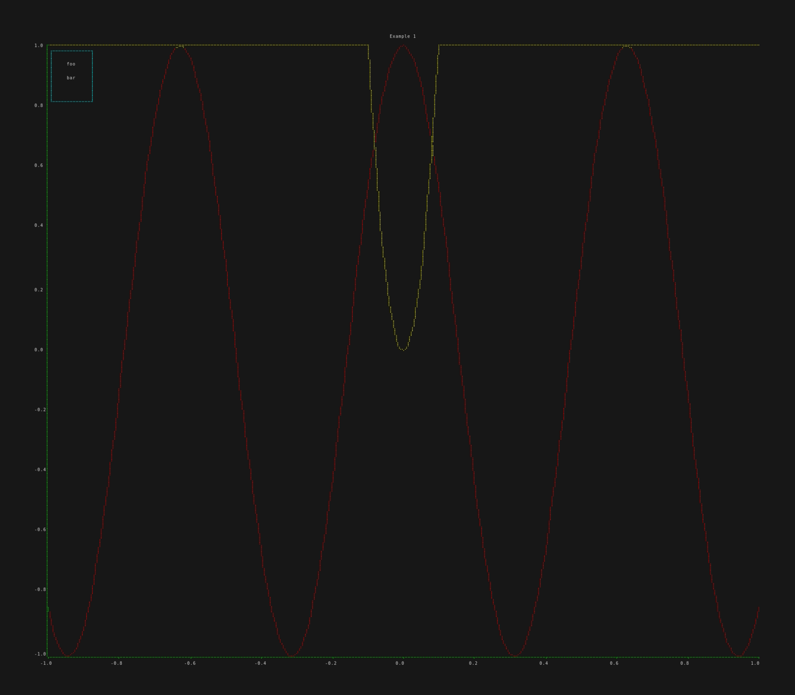
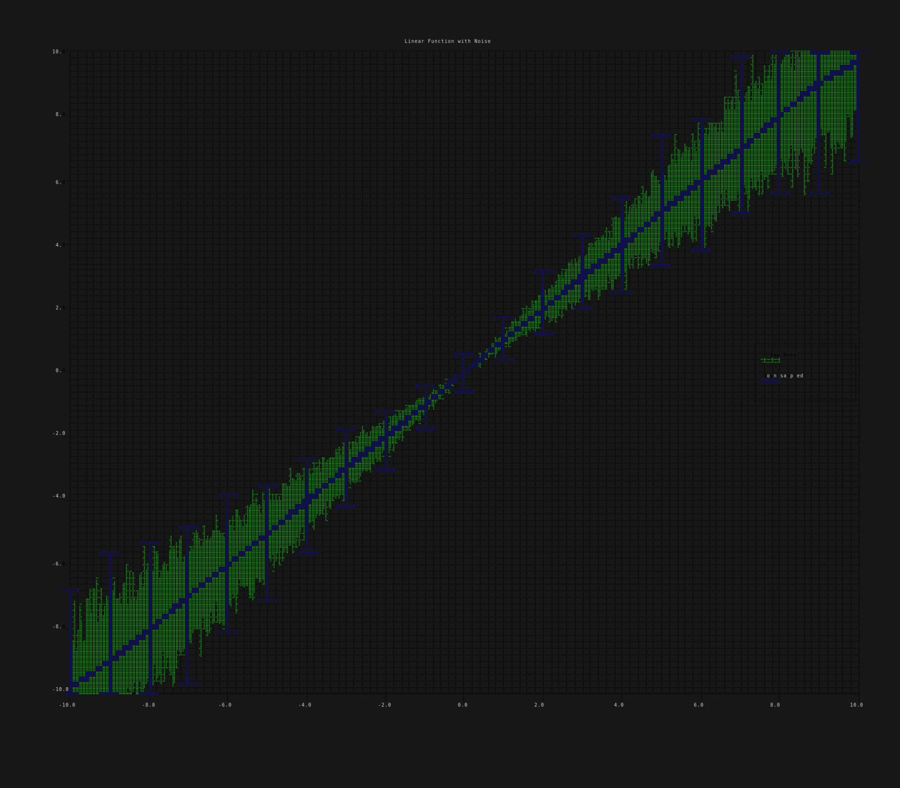
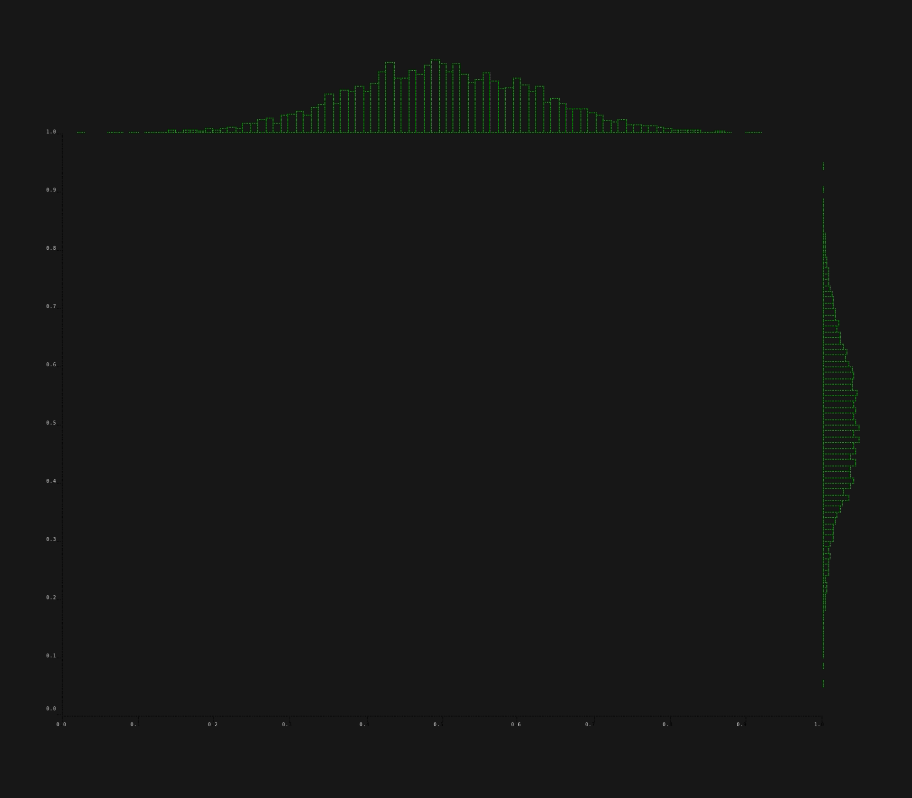
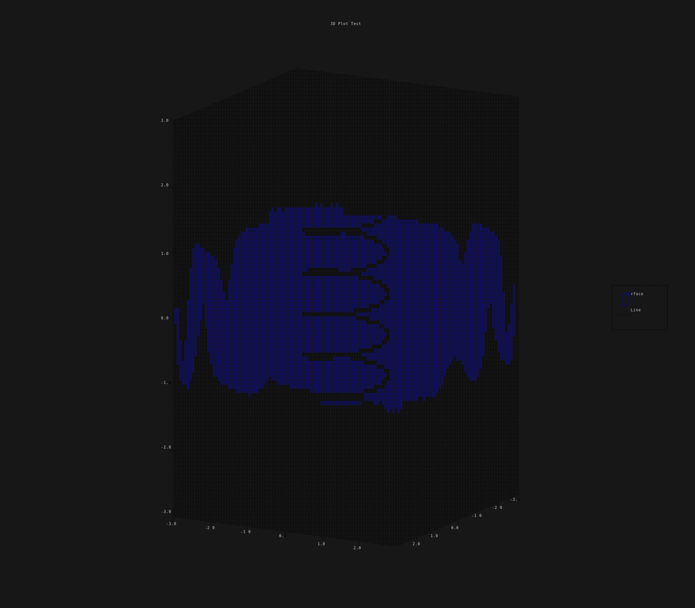

# plotters-ratatui-backend

A ratatui widget for drawing a plotters chart.

## Tests

When running tests please note the following constraints.

The tests *require* human interaction.  An image is displayed in the upper section of the terminal, with a yes/no question in the lower section.  Inspect the image, and respond to the question with 'y' or 'n' as appropriate.

Because the tests require a `ratatui` display loop, they **MUST** be run single threaded `--test-threads=1`, e.g. `cargo test -- --test-threads=1`.
